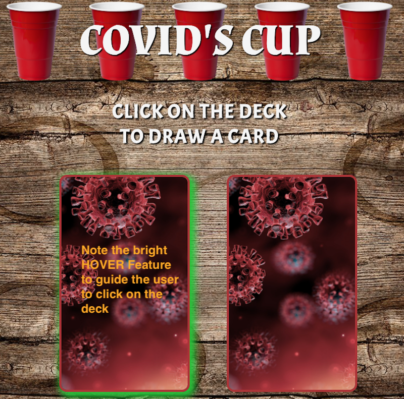
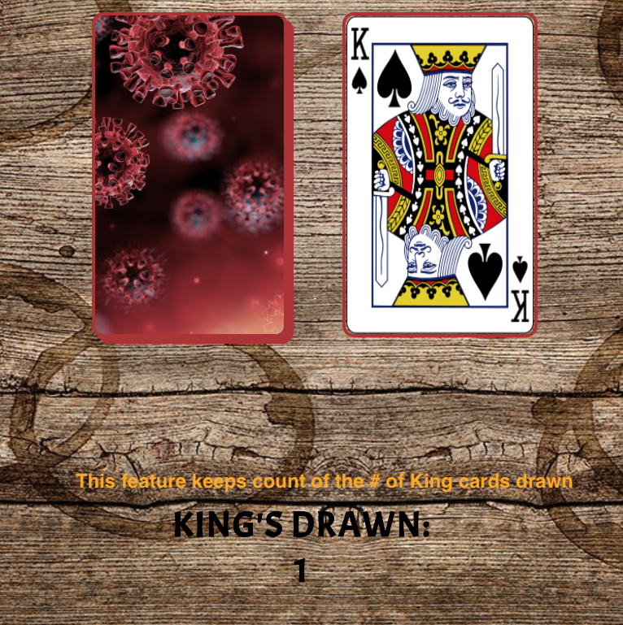

# COVID's-Cup

This is a solo drinking game for the second wave. 
A COVID-19 themed version of the party-game known as "King's Cup", "King's" or other monikers. 

## Motivation

Many of us are trapped at home, socially distancing, and drinking solo. This project makes the drinking alone FUN instead of sad. 

## Version 1.0

## Screenshots

## Technologies Used

- API used: https://deckofcardsapi.com/
- CSS3
- HTML5
- jQuery v3.5
- jQuery Modal
- AJAX

## Features
- Hover feature on the "Deck" will guide the user to click on the correct deck to start the game
- Clicking on the highlighted "deck" will "turn over" a card
- A card will show up and a prompt will pop up directing the user to a task
   - all tasks can be performed solo
- The # of Kings turned over is kept track of below the deck
- The game ends when 4 Kings are turned over
- The game is fitted for mobile screens as well, portrait-view only. 

## Link(s)
- https://eshoe2020.github.io/COVIDs-cup/

## Stretch Goals/Future Goals
- Fix issue with first card prompt not appearing
- Make the prompts modal error-proof (CORS issue?)
- Add animation to click so it looks like a card is being turned over
- Add spotify link to FIVE prompt
- Have rotating lists of prompts, wider variety of tasks
- Make a widescreen-friendly version