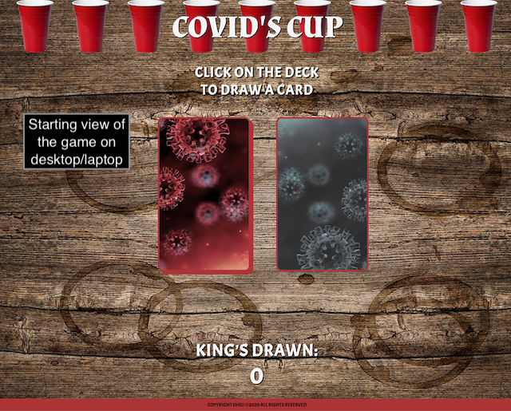
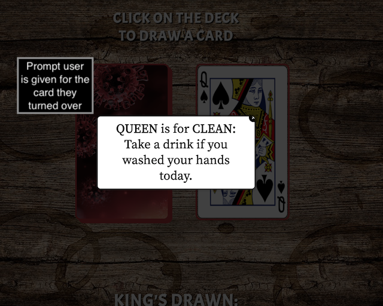

# COVID's-Cup

This is a solo drinking game for the second wave. 
It is a COVID-19-themed version of the party game you may know as "King's Cup", "King's" or by other monikers. 

## Motivation

Many of us are trapped at home socially distancing, and drinking solo. This project aims to make the act of drinking alone FUN instead of sad. 

## Version 1.0

## Screenshots

## Technologies Used

- API used: https://deckofcardsapi.com/
- CSS3
- HTML5
- jQuery v3.5
- jQuery Modal
- AJAX

## Features

- Hover feature on the "Deck" will guide the user to click on the correct deck to start the game.
- Clicking on the highlighted "deck" will "turn over" a card.
- A card will show up and a prompt(modal) will pop up directing the user to a task.
   - all tasks can be performed solo.
- To exit the prompt the user can click anywhere outside of the prompt, or in the X in the corner.
- The # of Kings turned over is kept track of below the deck.
- The game ends when 4 Kings are turned over.
- The game is fitted for mobile screens as well, portrait-view only. 
- Note: user must be careful to exit prompt by clicking ONLY on the "X" in the corner

## Link(s)

- https://eshoe2020.github.io/COVIDs-cup/

## Stretch Goals/Future Goals

- Eliminate the toggle mishaps when you click outside of the "X" to exit.
- Add animation to click so it looks like a card is being turned over.
- Increase/diversify the prompts, including but not limited to:
   - Add more specific ACE prompts (on aces 1+3, Aces are drawn you must keep your pinky out, on Aces 2+4, you can put your pinky down).
   - Add spotify link to FIVE prompt.
   - Make prompts that are suit-dependent as well.
- Make a landscape-friendly version for mobile phones.